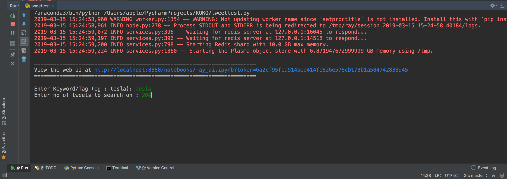

# Sentiment Analysis Plotter

Sentiment Analysis Plotter plots the overall sentiment of a given hastag eg:#tesla, #india etc.


## Model run





## Getting Started

Clone this repository in your system, run the sentiment_analyser.py first to get the idea of how the program 
works, in the later stages run the tweetest.py, in tweetest.py provide the API keys

### Prerequisites

```
Python3.3 & >
Pandas
Sklearn
nltk
ray 
matplotlib
tweepy
```

## Built With

* [tweepy](http://www.tweepy.org) - Python framework for accessing twitter API
* [ray](https://ray.readthedocs.io/en/latest/tutorial.html) - Distributed execution engine
 

## Authors

* **Parth Sharma** - [Parth Sharma](https://parthsharma1011.github.io)


